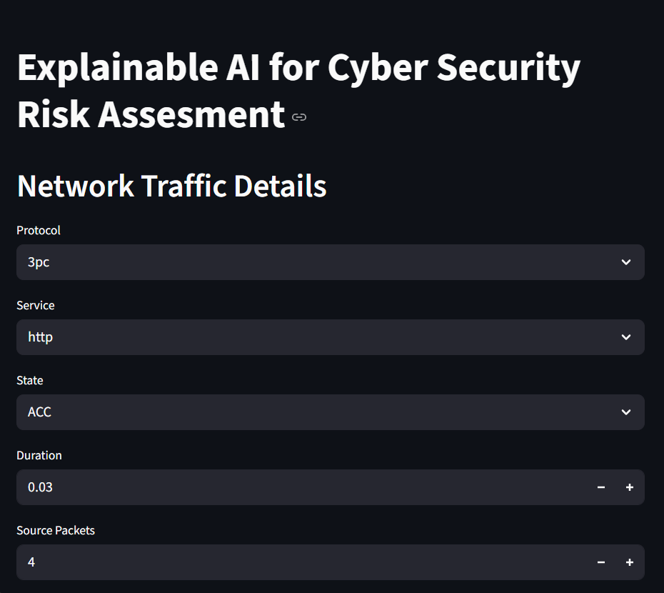
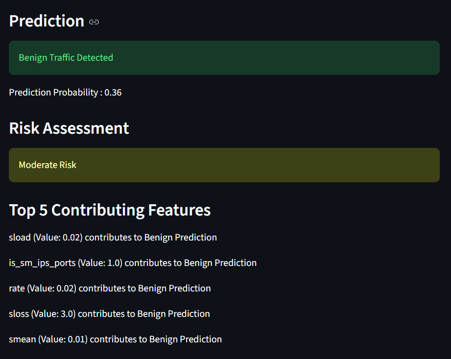
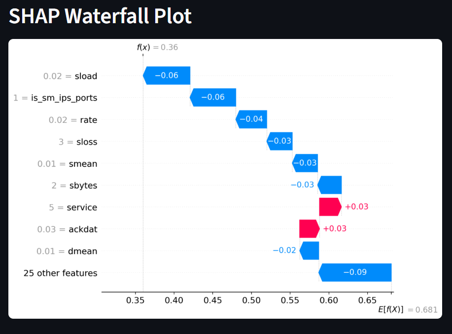

# Explainable AI for Cyber Security Risk Assessment


## Project Objective

The objective of this project is to build an interpretable cyber security risk assessment system that not only detects malicious network traffic but also explains the reasoning behind each prediction using Explainable AI techniques.

## Project Overview

This project uses Machine Learning and Explainable AI (XAI) techniques to detect malicious network traffic and provide transparent explanations for each prediction.

The system classifies network traffic as either:

- Benign Traffic
- Malicious Traffic

In addition to prediction, the model explains why a particular decision was made using SHAP (SHapley Additive exPlanations), making the results interpretable and easier to understand.

---

## Features

- Network traffic classification using Random Forest
- Interactive prediction through Streamlit
- Risk assessment based on prediction probability
- Explainable AI using SHAP
- Human-readable explanations for predictions
- Top contributing features identification
- SHAP Waterfall Plot visualization

---

## Technologies Used

- Python
- Scikit-Learn
- Pandas
- NumPy
- SHAP
- Joblib
- Streamlit
- Matplotlib

---

## Dataset

The project uses network traffic features from the UNSW-NB15 Cyber Security Dataset.

Example features include:

- Protocol
- Service
- State
- Packet Counts
- Byte Counts
- Load Metrics
- TCP Metrics
- HTTP Features
- FTP Features

A total of 34 network traffic features are used for prediction.

---

## Model Development

1. Data Cleaning and Preprocessing
2. Label Encoding of Categorical Features
3. Feature Selection
4. Random Forest Model Training
5. Model Evaluation
6. Model Serialization using Joblib

Saved artifacts:

- rf_model.pkl
- feature_names.pkl
- le_proto.pkl
- le_service.pkl
- le_state.pkl

---


## Model Performance

The Random Forest Classifier was evaluated using a train-test split on the UNSW-NB15 dataset.

### Test Set Performance

| Metric | Score |
|----------|----------|
| Accuracy | 95.16% |
| Precision (Malicious) | 95% |
| Recall (Malicious) | 97% |
| F1-Score (Malicious) | 96% |

### Classification Report (Test Data)

| Class | Precision | Recall | F1-Score |
|---------|---------|---------|---------|
| Benign (0) | 0.94 | 0.90 | 0.92 |
| Malicious (1) | 0.95 | 0.97 | 0.96 |

### Training Set Performance

| Metric | Score |
|----------|----------|
| Accuracy | 86.59% |

| Class | Precision | Recall | F1-Score |
|---------|---------|---------|---------|
| Benign (0) | 0.96 | 0.73 | 0.83 |
| Malicious (1) | 0.82 | 0.97 | 0.89 |

The model achieved an overall test accuracy of **95.16%**, demonstrating strong performance in distinguishing between benign and malicious network traffic while maintaining interpretability through SHAP-based explanations.


## Explainable AI Implementation

SHAP TreeExplainer is used to explain model predictions.

For every prediction:

- SHAP values are calculated
- Top 5 contributing features are identified
- Human-readable explanations are generated
- SHAP Waterfall Plot is displayed

Example Explanation:
rate = 1200 increased attack probability
sload = 850 increased attack probability
dload = 45 decreased attack probability


---

## Streamlit Application

The Streamlit interface allows users to:

1. Enter network traffic details
2. Predict whether traffic is malicious or benign
3. View prediction probability
4. View risk level
5. Understand why the prediction was made through SHAP explanations

---

## Installation

### Clone Repository

```bash
git clone <repository-url>
cd Explainable-AI-for-Cyber-Security-Risk-Assessment
```

### Create Environment

```bash
conda create -n cybersec python=3.11 -y
conda activate cybersec
```

### Install Dependencies

```bash
pip install -r requirements.txt
```

## Run the Application

```bash
streamlit run app.py
```

Application URL:

```text
http://localhost:8501
```

## Project Structure

Explainable-AI-for-Cyber-Security-Risk-Assessment/
│
├── app.py
├── requirements.txt
├── README.md
│
├── models/
│   ├── rf_model.pkl
│   ├── feature_names.pkl
│   ├── le_proto.pkl
│   ├── le_service.pkl
│   └── le_state.pkl
│
└── notebooks/
    └── model_training.ipynb


## Future Enhancements

- Attack category prediction
- SHAP Force Plot integration
- Feature importance dashboard
- Streamlit Cloud deployment
- Real-time network traffic monitoring


## Application Screenshots

### Home Page


### Prediction Result


### SHAP Explanation



## Authors

- Evangeline Soundarya
- Baline Karunya


